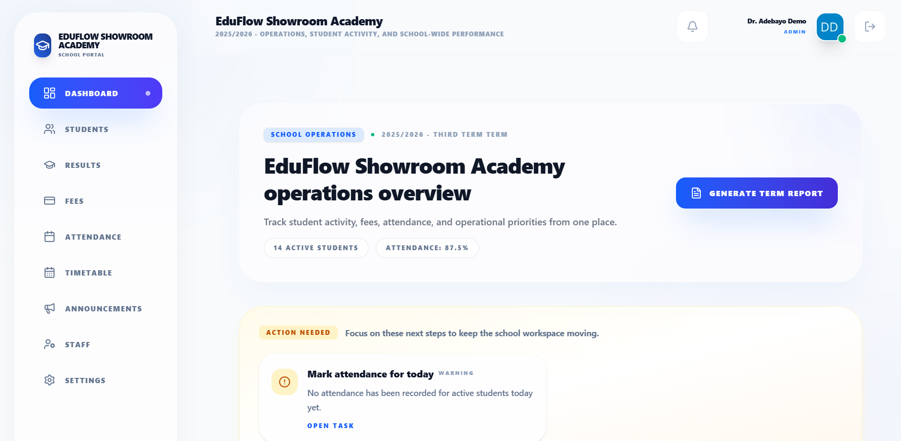
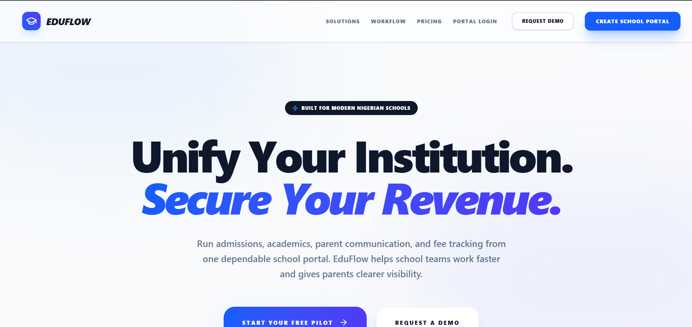

# Oluwasina OkikiJesu Portfolio

Portfolio website for Oluwasina OkikiJesu, a full-stack engineer and founder of Factory.ng building digital infrastructure for African markets.

This site is designed to present more than a list of skills. It shows how I think about product, engineering, and execution: shipping real systems end-to-end, owning architecture decisions, and building software for real operating environments.

Live site: [okikijesutech.vercel.app](https://okikijesutech.vercel.app/)

Resume: [Download Resume](./public/okikijesu_oluwasina_resume.pdf)

## Who This Portfolio Represents

I am a full-stack engineer based in Lagos, Nigeria. Through Factory.ng, I build products across EdTech, CleanTech, and security, often as the sole engineer from architecture to production.

This portfolio is meant to communicate:

- product ownership, not just feature implementation
- strength across frontend, backend, data, and deployment
- experience building for African users and operating constraints
- an engineering style that values clarity, speed, and real-world utility

## What The Site Highlights

- `About` section with background, technical focus, and core stack
- `Experience` section covering Factory.ng, O3 Finance School, and Flincap
- `Projects` section featuring products like `EduFlows`, `PwmngerTS`, and `Omoluabi`
- `Contact` section for direct outreach
- responsive navigation and layout across desktop, tablet, and mobile
- motion-led presentation using Framer Motion
- custom cursor interactions on fine-pointer devices

## Featured Work

### EduFlows

Multi-tenant school management SaaS for Nigerian private schools, covering fee collection, results, timetabling, and operational workflows with strict tenant data isolation.

### PwmngerTS

Open-source zero-knowledge password manager with client-side encryption and a security-first architecture shaped by full audit feedback.

### Omoluabi

Open-source Yoruba language learning platform focused on cultural preservation through accessible digital learning experiences.

## Screens

### EduFlows Dashboard



### EduFlows Landing



## Tech Stack

- React 19
- TypeScript
- Vite 8
- Framer Motion
- Lucide React
- Tailwind tooling via `@tailwindcss/vite`
- ESLint 9

## Engineering Notes

This portfolio is intentionally built as a focused single-page experience instead of a multi-route application. The goal is to keep attention on narrative, work, and credibility.

A few implementation choices worth calling out:

- motion is used to guide attention, not overload the interface
- the custom cursor is disabled automatically on touch and coarse-pointer devices
- the navigation adapts for mobile with a dedicated menu state
- project layouts collapse cleanly for smaller screens instead of preserving desktop overlap patterns
- dependency updates and security overrides are tracked directly in `package.json`

## Run Locally

```bash
git clone https://github.com/okikijesutech/okikiJesu_portfolio.git
cd okikiJesu_portfolio
npm install
npm run dev
```

Other useful commands:

```bash
npm run build
npm run lint
npm run preview
```

## Project Structure

```text
src/
  App.tsx
  index.css
  components/
    Navbar.tsx
    Hero.tsx
    About.tsx
    Experience.tsx
    Projects.tsx
    Contact.tsx
    SocialSidebar.tsx
    CustomCursor.tsx
public/
  Profile.JPG
  eduflowsDashboard.png
  eduflowsLanding.png
  okikijesu_oluwasina_resume.pdf
```

## Links

- Portfolio: [okikijesutech.vercel.app](https://okikijesutech.vercel.app/)
- GitHub: [github.com/okikijesutech](https://github.com/okikijesutech)
- LinkedIn: [linkedin.com/in/okikijesu](https://www.linkedin.com/in/okikijesu/)
- Factory.ng: [the-factory-ng.vercel.app](https://the-factory-ng.vercel.app/)

## Author

Built and designed by [Oluwasina OkikiJesu](https://github.com/okikijesutech).
